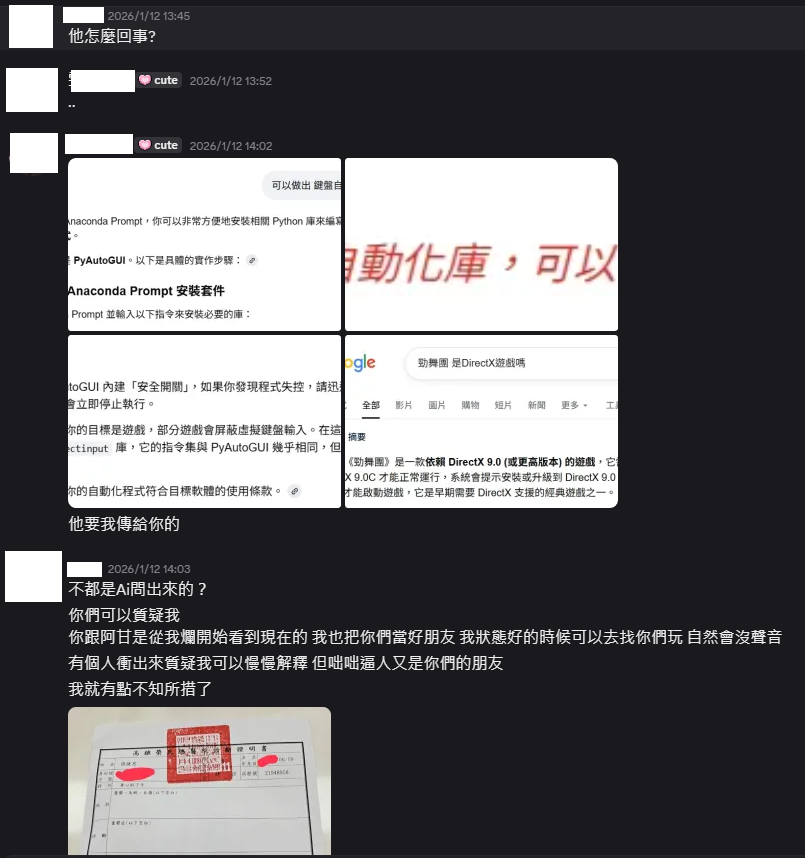
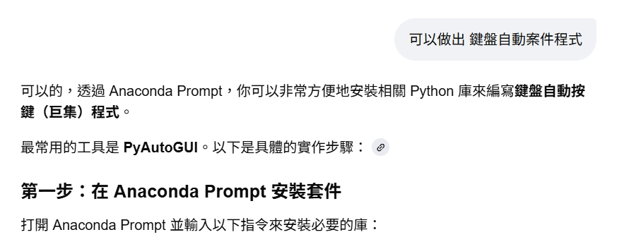
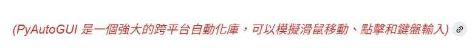
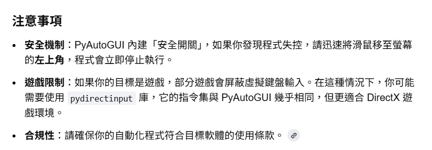

## 僅為研究用途,不完美我也沒打算繼續維護

## 為什麼要修復這個?
我是台服囈語，一直以來我只想好好玩我的遊戲並且安靜的交朋友

在26年1月12號,被質疑使用外掛，我已經給與遠端給該為質疑者及友人看，找不出任何開掛的原因

但結果令人失望，我是個重鬱症患者，朋友給我的態度真的讓我死心

只因我為自動化工程師 擁有Anaconda Prompt 就用AI 去給我安插一個罪名

我也沒有那麼強的技術可以從頭建一個，我只好參照你問AI的方法

修復一個開源的外掛，讓你知道外掛怎麼運行的


<p align="center">
    
    </br>
    
    </br>
    
    </br>
    
    </br>
    
    </br>

## 如何使用?

參照Installation 將環境運行好後

以後只需要使用系統管理員開啟Anaconda Prompt

並貼上以上指令

cd "C:\Users\XXX\Desktop\auto-audition"  (請直接複製你的專案路徑)

conda activate au

python audition_bot.py

# Auto Audition Game Hack Software

Auto play Audition game by using basic image processing techniques.

This project was done in 2 days for the purpose of killing my time.

Commercializing this project is prohibited and illegal.


## Results

[

## Installation

1. Create environment(創建環境 貼入以下指令運行)

```bash
conda create --name au python=3.7.7
conda activate au
conda install -c conda-forge jupyterlab
pip install opencv-python
pip install pillow
pip install imutils
pip install keyboard
pip install mss
pip install pywin32

```

2. Run python audition_bot.py (在Anaconda Prompt au虛擬環境下 並在專案資料夾下運行)
    - Press `F9` button stop bot 


## How it works?

Firstly, the game window will be scanned by using
[python-mss](https://github.com/BoboTiG/python-mss).

Secondly, the region of keys (arrows) and the perfect area
(the area which has the running marker) will be cropped.
These regions are in fixed positions.

<p align="center">
    
    </br>
    
</p>

Finally, some tricky image processing algorithms will be performed
on the keys area to detect the keys.
Simultaneously, some algorithms will also be applied in the perfect area
to detect the time when we should hit Ctrl (to hit perfect).


### Key detection

From the keys area image, I threshold it to get the arrows only.
Then the contour detection algorithm will help us to find those separated arrows.
I sort the contours to make it sequential from left to right.
Now I have each key separated as a ROI (region of interest)
by getting the bounding boxes of those contours.

<p align="center">
    
    </br>
    
</p>

For each ROI (bounding box of key's contour) as below, I split it into 4 regions
red, blue, green, and purple. The region that has the highest amount of white pixels
will contain the arrow's head.

<p align="center">
    
</p>

For the blue/red key, I convert the original RGB image into HSV color space then
just apply [this trick](https://docs.opencv.org/trunk/df/d9d/tutorial_py_colorspaces.html)
to detect whether this ROI is blue-ish or red-ish.


### Perfect detection

There are 2 main tasks here. The first one is to detect the marker position.
The other one is to measure the time we need to hit Ctrl.

For the first task, I use [template matching algorithm](https://opencv-python-tutroals.readthedocs.io/en/latest/py_tutorials/py_imgproc/py_template_matching/py_template_matching.html)
to measure the correlation coefficients of the 2 images which are the perfect area
and the marker itself. The matchest position is the marker's position.

<p align="center">
    
</p>

By getting 2 marker's positions at 2 consecutive periods, I interpolate the speed
of the marker.

For the second task, we just get the current marker's position, then calculate the
time it takes to go to the Perfect Position by using the above computed speed.

<p align="center">
    
</p>


### Combination

I create 2 threads. One thread is to control the keys. The other one is
to control when we should hit Ctrl.

I also define "one loop" is the period of time that the marker runs from the head
to the end (tail) or the perfect bar.

<p align="center">
    
</p>

On the keys controlling thread, I wait until the marker is at the head part.
Then I perform keys detection and send the keyboard code to the game window.
Then I wait until the marker is at the tail part. That is to make sure
the keys detection will be performed one time per loop.

For the Ctrl hitting thread, the Ctrl hitting time detection will be started
only when the marker passed the middle of the perfect bar. This is to make sure
the algorithm doesn't measure the hitting time too soon. The farther
the marker is to the perfect position, the worse the measurement will be.

<p align="center">
    
</p>

Because the measurement of the time we should hit Ctrl is not good enough,
every time it calculates I will add/subtract a small amount of time.
I use `Page Up` and `Page Down` buttons to adjust that small changes.
[keyboard library](https://pypi.org/project/keyboard/) was used to listen to
the global key events.

Keyboard keys are sent to the game window by using KeyboardCtrl class (check `keyboard_ctrl.py`).


## Limitation

I don't design any mechanism to get feedback on how accurate the measurement is.
Therefore, there's no way to adjust the hitting Ctrl time.

The project should be done by using the Reinforcement-Learning-based method or
some PID-based algorithm with the feedback mechanism to adjust the control.


## Contributing

Any contribution is welcome.
